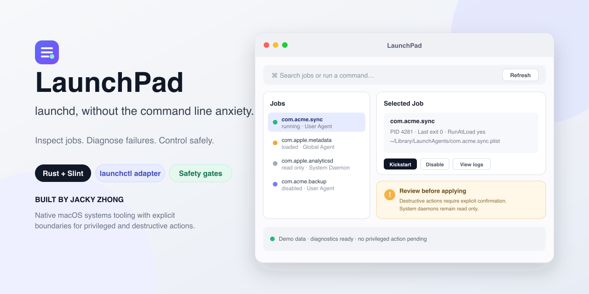
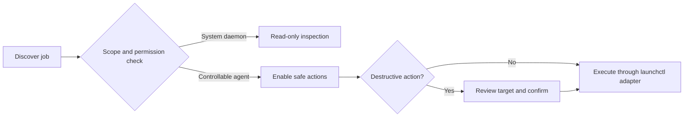

<p align="center">
  
</p>

<h1 align="center">LaunchPad</h1>

<p align="center"><strong>See, diagnose, and control macOS <code>launchd</code> jobs without memorizing <code>launchctl</code>.</strong></p>

<p align="center">
  <a href="https://github.com/Jacky040124/launchd-gui/actions/workflows/ci.yml"></a>
  
  
  <a href="LICENSE"></a>
</p>

<p align="center"><sub>Code-native product overview based on the current Slint interface. Demo data is shown.</sub></p>

## What I engineered

1. A native Rust GUI over `launchctl` discovery, status, diagnostics, and job actions.
2. A layered architecture that separates filesystem and process adapters from domain rules, services, and UI state.
3. Explicit safety gates for privileged and destructive operations, including read-only system daemons and two-step deletion.

**Rust + Slint** · **66 passing tests** · **explicit capability checks before actions**

## Why LaunchPad exists

macOS background jobs are powerful, but their state is split across plist files, `launchctl` commands, unified logs, permissions, and multiple scopes. The result is a workflow that is easy to inspect incorrectly and risky to edit casually.

LaunchPad brings those surfaces into one reviewable workspace:

| Outcome | Current implementation |
|---|---|
| **Find jobs** | Scans user agents, global agents, and system daemons with search, scope, status, and attribute filters |
| **Diagnose failures** | Combines fast `launchctl list` status with on-demand `launchctl print` details and recent unified logs |
| **Control safely** | Starts, stops, kickstarts, loads, unloads, enables, and disables only when scope and permissions allow |
| **Edit with review** | Builds plist XML from a standard editor, runs diagnostics, and requires confirmation before destructive changes |

## Safety is part of the product

LaunchPad does not treat every discovered job as equally mutable.



The same capability model is used by the UI and service layer, so disabled controls are backed by domain rules rather than presentation alone.

## Current status

LaunchPad is a **source prototype**, not a signed or notarized macOS release yet.

### Implemented in the current source build

1. Job discovery across `~/Library/LaunchAgents`, `/Library/LaunchAgents`, and `/Library/LaunchDaemons`.
2. Search, scope, status, starred-only, and plist-attribute filters.
3. Bulk status plus on-demand runtime details.
4. Guarded trigger actions and two-step deletion.
5. Persistent starred jobs and copyable diagnostics.
6. Standard plist creation and editing with XML preview and rule-based diagnostics.
7. History and short live-capture log views.
8. A command palette over the same service actions.

### Experimental

1. AI-assisted plist suggestions and provider adapters.
2. QuickLaunch snapshot, helper, and menu-bar integrations.
3. Advanced or undocumented plist keys represented as expert entries.

### Not shipped yet

1. A signed, notarized, downloadable app bundle.
2. Automated end-to-end tests against real macOS `launchctl` state.
3. A fully general editor for arbitrary nested plist structures.

See the [macOS manual test plan](docs/manual-test-macos.md) for the current main-path checklist.

## Architecture

```text
Slint UI
   │
Application controller
   │
Service layer           job · action · delete · plist · logs · AI · QuickLaunch
   │
Domain rules            status · capabilities · filters · plist model
   │
Adapters                launchctl · filesystem · unified logs · clipboard · providers
```

Two choices keep the system responsive and testable:

1. Refresh uses one bulk `launchctl list` query; deeper `launchctl print` work happens only for the selected job.
2. Process execution and filesystem access sit behind traits, allowing service behavior to be tested with mocks.

Read the full [architecture overview](docs/architecture.md).

## Build from source

### Requirements

1. macOS with a GUI session.
2. Rust stable. The current dependency graph is validated with Rust 1.94 or newer.

```bash
git clone https://github.com/Jacky040124/launchd-gui.git
cd launchd-gui
cargo run --bin launchpad
```

LaunchPad reads the normal user and system launchd locations. Test write actions on a disposable user LaunchAgent first.

## Validate

```bash
cargo fmt --all -- --check
cargo clippy --all-targets --all-features -- -D warnings
cargo test --all-targets
```

The repository includes 66 passing unit and integration tests across domain logic, adapters, job actions, deletion, starring, and QuickLaunch behavior. Real system behavior still requires the [macOS manual test plan](docs/manual-test-macos.md).

## Deeper documentation

1. [Architecture](docs/architecture.md)
2. [AI providers](docs/ai-providers.md)
3. [macOS manual test plan](docs/manual-test-macos.md)

## License

[MIT](LICENSE)
